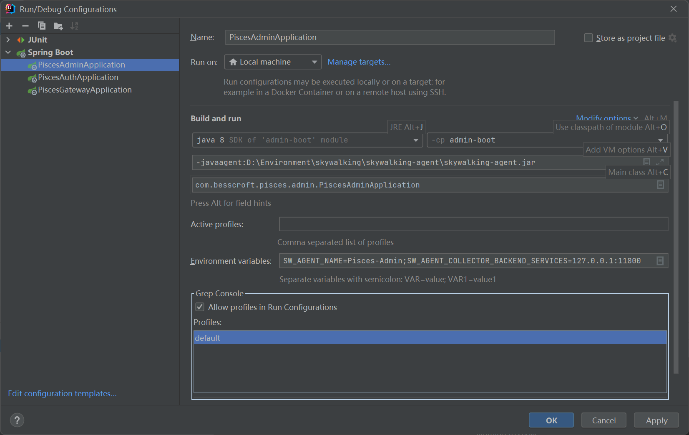
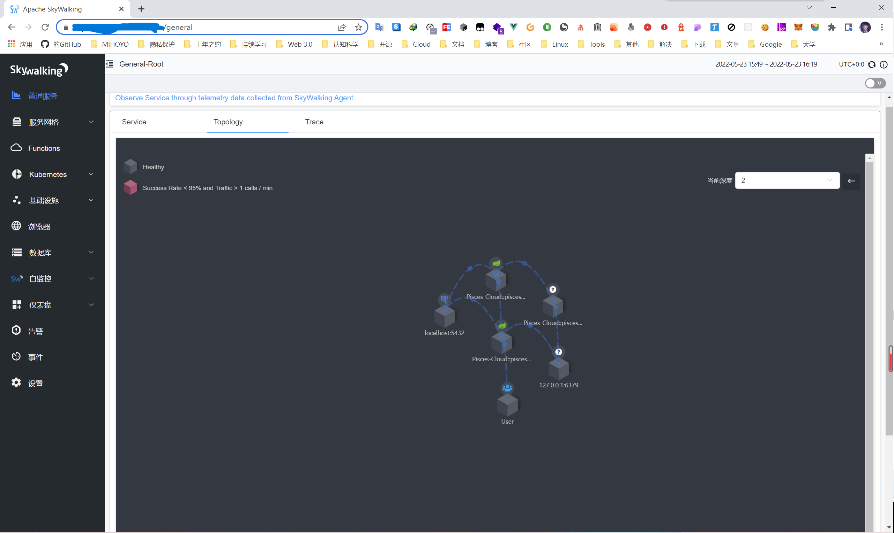
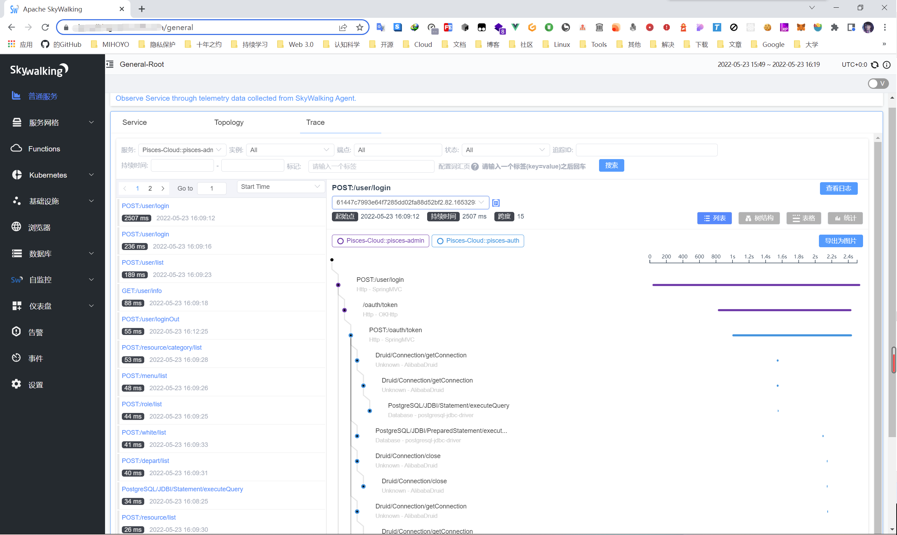
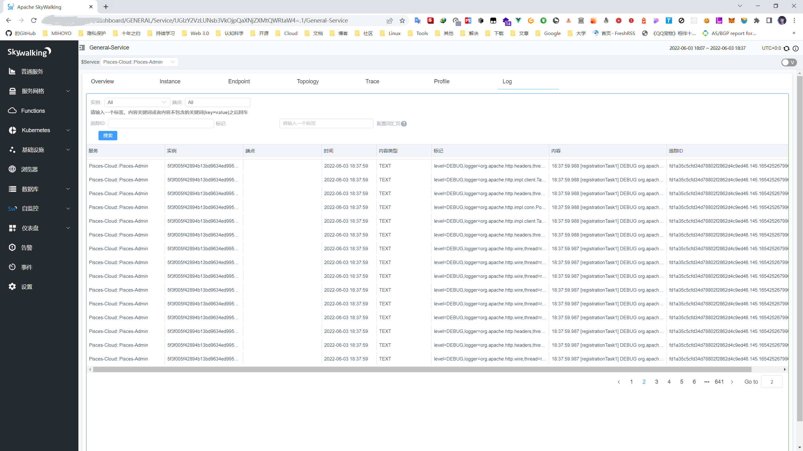

# APM 性能监视支持

这里提供本项目对于 SkyWalking APM 的支持说明，注意，如何搭建高可用的 SkyWalking UI 和 SkyWalking OAP，不属于本文档的范围，你可以参考 [官方文档](https://skywalking.apache.org/docs/)。

## 本地开发环境配置 SkyWalking Agent

假设这里你已经在开发环境安装了 SkyWalking UI 和 SkyWalking OAP，那么可以看接下来的步骤：

在 idea 中打开 `Run/Debug Configurations`，并按照下图的步骤进行配置：



第一个红框框的内容，是 `JVM Options` 参数：

```
-javaagent:D:\Environment\skywalking\skywalking-agent\skywalking-agent.jar
```

在 `-javaagent:` 后面的是你开发环境的 `skywalking-agent.jar` 包的绝对路径位置。

第二个红框框，是配置 `SkyWalking Agent` 的环境变量：

```
SW_AGENT_NAME=Pisces-Admin;SW_AGENT_COLLECTOR_BACKEND_SERVICES=127.0.0.1:11800
```

`SW_AGENT_NAME` 的值填写你要指定的 `Service Names`，如果你需要同时配置 `Service Groups`，你可以这样写：

```
SW_AGENT_NAME=Pisces-Cloud::pisces-admin;
```

`::` 符号前面的就是 `Service Groups`，后面的就是 `Service Names`。

`SW_AGENT_COLLECTOR_BACKEND_SERVICES` 的值填写你的 `SkyWalking OAP` 的 `Agent Backend Service` 的地址。

## 部署带有 SkyWalking Agent 支持的 Docker 镜像

在阅读这里之前，你首先得阅读<a href="../deploy#docker-部署-java-服务">Docker 部署 Java 服务</a>，这里的部署方式，是基于该文档的扩展。

- Piaces-Gateway 示例命令：

```shell
docker run -d --name pisces-gateway \
  -p 8000:8000 \
  -e JAVA_OPTS="-Xms512m -Xmx512m -Duser.timezone=GMT+08 -Dfile.encoding=UTF8" \
  -e SPRING_CONFIG="--spring.profiles.active=prod --spring.cloud.nacos.discovery.server-addr=http://127.0.0.1:8848" \
  -e SW_AGENT_COLLECTOR_BACKEND_SERVICES="-Dskywalking.collector.backend_service=127.0.0.1:11800" \
  -e SW_AGENT_NAME="-Dskywalking.agent.service_name=Pisces-Cloud::pisces-gateway" \
  besscroft/pisces-gateway:v2.0.0-agent
```

- Piaces-Auth 示例命令：

```shell
docker run -d --name pisces-auth \
  -p 22333:22333 \
  -e JAVA_OPTS="-Xms512m -Xmx512m -Duser.timezone=GMT+08 -Dfile.encoding=UTF8" \
  -e SPRING_CONFIG="--spring.profiles.active=prod --spring.cloud.nacos.discovery.server-addr=http://127.0.0.1:8848" \
  -e SW_AGENT_COLLECTOR_BACKEND_SERVICES="-Dskywalking.collector.backend_service=127.0.0.1:11800" \
  -e SW_AGENT_NAME="-Dskywalking.agent.service_name=Pisces-Cloud::pisces-auth" \
  besscroft/pisces-auth:v2.0.0-agent
```

- Pisces-Admin 示例命令：

```shell
docker run -d --name pisces-admin \
  -p 20100:20100 \
  -e JAVA_OPTS="-Xms512m -Xmx512m -Duser.timezone=GMT+08 -Dfile.encoding=UTF8" \
  -e SPRING_CONFIG="--spring.profiles.active=prod --spring.cloud.nacos.discovery.server-addr=http://127.0.0.1:8848" \
  -e SW_AGENT_COLLECTOR_BACKEND_SERVICES="-Dskywalking.collector.backend_service=127.0.0.1:11800" \
  -e SW_AGENT_NAME="-Dskywalking.agent.service_name=Pisces-Cloud::pisces-admin" \
  besscroft/pisces-admin:v2.0.0-agent
```

- Pisces-File 示例命令：

```shell
docker run -d --name pisces-file \
  -p 20890:20890 \
  -e JAVA_OPTS="-Xms512m -Xmx512m -Duser.timezone=GMT+08 -Dfile.encoding=UTF8" \
  -e SPRING_CONFIG="--spring.profiles.active=prod --spring.cloud.nacos.discovery.server-addr=http://127.0.0.1:8848" \
  -e SW_AGENT_COLLECTOR_BACKEND_SERVICES="-Dskywalking.collector.backend_service=127.0.0.1:11800" \
  -e SW_AGENT_NAME="-Dskywalking.agent.service_name=Pisces-Cloud::pisces-file" \
  besscroft/pisces-file:v2.0.0-agent
```

- Pisces-AMQP 示例命令：

```shell
docker run -d --name pisces-amqp \
  -p 20990:20990 \
  -e JAVA_OPTS="-Xms512m -Xmx512m -Duser.timezone=GMT+08 -Dfile.encoding=UTF8" \
  -e SPRING_CONFIG="--spring.profiles.active=prod --spring.cloud.nacos.discovery.server-addr=http://127.0.0.1:8848" \
  -e SW_AGENT_COLLECTOR_BACKEND_SERVICES="-Dskywalking.collector.backend_service=127.0.0.1:11800" \
  -e SW_AGENT_NAME="-Dskywalking.agent.service_name=Pisces-Cloud::pisces-amqp" \
  besscroft/pisces-amqp:v2.0.0-agent
```

> SW_AGENT_COLLECTOR_BACKEND_SERVICES 主要用来设置 `SkyWalking OAP` 的 `Agent Backend Service` 的地址。SW_AGENT_NAME 主要用来设置 `Service Names` 和 `Service Groups` 名称。

启动成功之后，简单访问几个接口，让 Agent 上报数据看看效果，如下图所示：




### 日志追踪支持

通过 gRPC reporter 的方式，将程序中由 logback 输出的日志上报到 `SkyWalking OAP` 服务器中。

在 `logback-spring.xml` 中，配置如下：

```xml
<appender name="grpc-log" class="org.apache.skywalking.apm.toolkit.log.logback.v1.x.log.GRPCLogClientAppender">
    <encoder class="ch.qos.logback.core.encoder.LayoutWrappingEncoder">
        <layout class="org.apache.skywalking.apm.toolkit.log.logback.v1.x.mdc.TraceIdMDCPatternLogbackLayout">
            <Pattern>%d{yyyy-MM-dd HH:mm:ss.SSS} [%X{tid}] [%thread] %-5level %logger{36} -%msg%n</Pattern>
        </layout>
    </encoder>
</appender>
```

另外，在某些情况下，必须在 SkyWalking OAP 的 `/config/agent.config` 文件中，添加插件的配置或使用默认值：

```
plugin.toolkit.log.grpc.reporter.server_host=${SW_GRPC_LOG_SERVER_HOST:127.0.0.1}
plugin.toolkit.log.grpc.reporter.server_port=${SW_GRPC_LOG_SERVER_PORT:11800}
plugin.toolkit.log.grpc.reporter.max_message_size=${SW_GRPC_LOG_MAX_MESSAGE_SIZE:10485760}
plugin.toolkit.log.grpc.reporter.upstream_timeout=${SW_GRPC_LOG_GRPC_UPSTREAM_TIMEOUT:30}
```

- 传输未格式化的日志消息

logback gRPC 报告器支持以格式化或未格式化的形式传输日志。传输格式化数据是默认设置，但可以通过将以下内容添加到代理配置来禁用：

```
plugin.toolkit.log.transmit_formatted=false
```

效果如下所示，当然，你可以自定义每一个配置，来获取你想要的日志：


