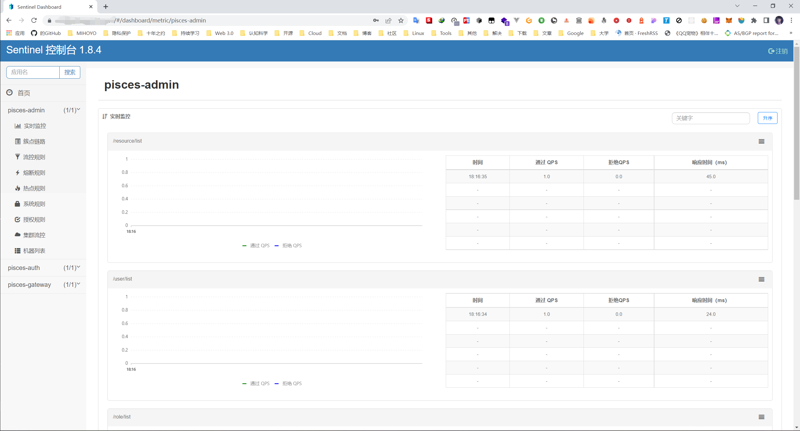

# Sentinel 流量控制/熔断降级支持

随着微服务的流行，服务和服务之间的稳定性变得越来越重要，本项目采用 Sentinel 来进行支持。Sentinel 是面向分布式服务架构的流量控制组件，主要以流量为切入点，从流量控制、熔断降级、系统自适应保护等多个维度来帮助您保障微服务的稳定性。

## 部署配置

### 部署 Sentinel 控制台

先去 [release](https://github.com/alibaba/Sentinel/releases) 页面，下载对应版本的 jar 包。

然后输入如下命令启动：

```shell
java -Dserver.port=8080 -Dcsp.sentinel.dashboard.server=localhost:8080 -Dproject.name=sentinel-dashboard -jar sentinel-dashboard.jar
```

其中 -Dserver.port=8080 用于指定 Sentinel 控制台端口为 8080。

从 Sentinel 1.6.0 起，Sentinel 控制台引入基本的登录功能，默认用户名和密码都是 sentinel。

### 配置部署 Sentinel 客户端

不管是哪个版本的 Docker 镜像，已经默认支持了 Sentinel 客户端，你需要做的，就是在启动之前，在对应的 nacos yaml 配置文件中，设置正确的参数。

- pisces-auth-${active}.yaml

```yaml
spring:
  cloud:
    # Sentinel 配置项，对应 SentinelProperties 配置属性类
    sentinel:
      enabled: true # 是否开启。默认为 true 开启
      eager: true # 是否饥饿加载。默认为 false 关闭
      transport:
        dashboard: 127.0.0.1:7070 # Sentinel 控制台地址
        port: 8719 # Sentinel 端口
      filter:
        enabled: true
```

- pisces-admin-${active}.yaml

```yaml
spring:
  cloud:
    # Sentinel 配置项，对应 SentinelProperties 配置属性类
    sentinel:
      enabled: true # 是否开启。默认为 true 开启
      eager: true # 是否饥饿加载。默认为 false 关闭
      transport:
        dashboard: 127.0.0.1:7070 # Sentinel 控制台地址
        port: 8719
      filter:
        enabled: true
```

- pisces-gateway-${active}.yaml

```yaml
spring:
  cloud:
    # Sentinel 配置项，对应 SentinelProperties 配置属性类
    sentinel:
      enabled: true # 是否开启。默认为 true 开启
      eager: true # 是否饥饿加载。默认为 false 关闭
      transport:
        dashboard: 127.0.0.1:7070 # Sentinel 控制台地址
        port: 8719
      # nacos配置持久化
      datasource:
        # 对应 DataSourcePropertiesConfiguration 类
        ds1:
          nacos:
            server-addr: 127.0.0.1:8848 # Nacos 服务器地址
            dataId: ${spring.application.name}-sentinel-flow-rule # Nacos 配置集编号
            groupId: DEFAULT_GROUP # Nacos 分组
            data-type: json # 数据格式
            rule-type: flow # 规则类型
```

启动成功后，就可以登录控制台看看啦，点几下功能，等待上报数据即可。


