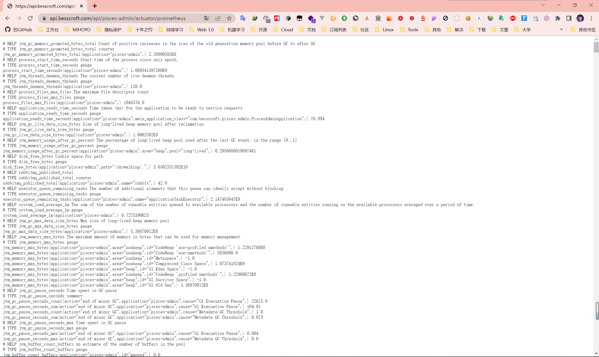
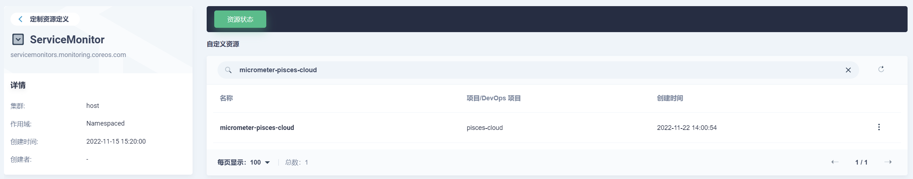
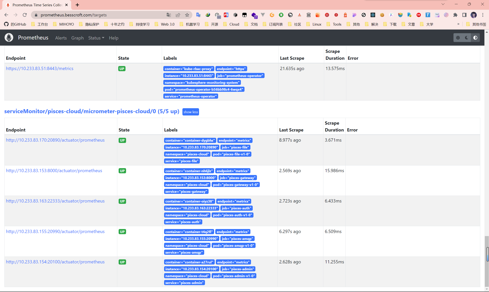
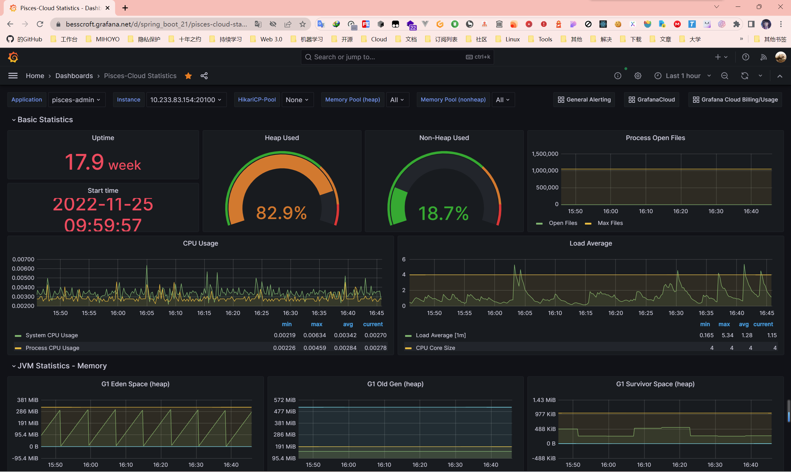

# Kubernetes Spring 微服务应用监控支持

## 项目方面的准备

### 引入依赖

在 spring 微服务项目中，我们需要引入 2 个重要的依赖：

```xml
<dependency>  
    <groupId>org.springframework.boot</groupId>  
    <artifactId>spring-boot-starter-actuator</artifactId>  
</dependency>  

<dependency>
    <groupId>io.micrometer</groupId>  
    <artifactId>micrometer-registry-prometheus</artifactId>  
</dependency>
```

我们需要引入这两个包，将 spring boot actuator 和 micrometer 集成到我们的 spring boot 项目中，从而暴露出我们需要的监控指标，以便 Prometheus 可以采集到。

### 配置

在 spring boot 项目中，我们需要在 application.yml 中配置一些基本的信息，以便 Prometheus 可以采集到我们的监控指标：

```yaml
# Actuator 配置
management:
  endpoints:
    web:
      exposure:
        # 监控项配置
        include: "*"
  endpoint:
    health:
      # 开启显示全部细节
      show-details: always
    shutdown:
      # 启用接口关闭 SpringBoot
      enabled: false
  # Micrometer 配置
  metrics:
    tags:
      application: ${spring.application.name}
```

> 这里对一些使用到的，以及未使用但也常用的配置进行说明：
> management.server.port：启用独立的端口来提供监控，未配置的情况下使用应用程序端口。 
> management.metrics.tags.xxx：在统计信息中添加自定义的标签。
> management.endpoints.web.exposure.include：用于包含要公开的端点列表，我们这里设置为* 代表全部公开。注意线上环境是否全部公开需要考虑诸多方面，比如安全性等。
> management.endpoints.web.base-path：用于设置 Promethues 的监控路径，默认是通过 /actuator/prometheus 访问，我们采用默认的配置即可。

配置完成之后，咱们重启项目，访问 ip:port/actuator/prometheus，如果能看到类似如下的监控指标，那么我们就可以开始配置 Prometheus 了。



## k8s 配置

### Service 配置

下面以 pisces-admin 服务的 Service 为例：

```yaml
kind: Service
apiVersion: v1
metadata:
  name: pisces-admin
  namespace: pisces-cloud
  labels:
    app: pisces-admin
    app.kubernetes.io/name: pisces-admin
    app.kubernetes.io/version: v1
    micrometer-prometheus-discovery: 'true' # 就是这一行 lable
    version: v1
  annotations:
    kubesphere.io/creator: admin
    kubesphere.io/serviceType: statefulservice
    servicemesh.kubesphere.io/enabled: 'false'
spec:
  ports:
    - name: metrics # 这里的 name 咱们改成了 metrics
      protocol: TCP
      port: 20100
      targetPort: 20100
  selector:
    app: pisces-admin
    app.kubernetes.io/name: pisces-admin
    app.kubernetes.io/version: v1
  clusterIP: None
  clusterIPs:
    - None
  type: ClusterIP
  sessionAffinity: None
  ipFamilies:
    - IPv4
  ipFamilyPolicy: SingleStack
  internalTrafficPolicy: Cluster
```

> 这里我们需要注意的是，我们需要在 Service 的 lable 中添加 micrometer-prometheus-discovery: 'true'，这样 Prometheus 才能发现我们的 Service，从而采集到我们的监控指标，以及我们需要将 Service 的端口名称改为 metrics。

### 创建 ServiceMonitor

演示环境我是放在 KuberSphere 上面的，平台自带了 promethus-operator。Prometheus 可以通过 ServiceMonitor 自动识别带有某些 label 的 service，而 ServiceMonitor 是 promethus-operator 的一个 CRD，所以我们需要创建一个 ServiceMonitor 来监控我们的 Service。

```yaml
apiVersion: monitoring.coreos.com/v1
kind: ServiceMonitor
metadata:
  name: micrometer-pisces-cloud
  namespace: pisces-cloud
spec:
  endpoints:
    - interval: 10s # 抓取间隔
      path: /actuator/prometheus # 抓取路径
      port: metrics # 抓取端口
  namespaceSelector:
    matchNames:
      - pisces-cloud # 抓取的 namespace
  selector:
    matchLabels:
      micrometer-prometheus-discovery: 'true' # 抓取的 lable
```

我来解释一下这个 yaml 的作用：抓取 namespace 为 pisces-cloud 的所有带有 micrometer-prometheus-discovery: 'true' 的 service，抓取路径为 /actuator/prometheus，抓取端口为 metrics。现在就和我们刚才配置的 Service 一样了，对吧？

然后我们新建一个名叫 `spring-micrometer.yaml` 的文件，将上面的 yaml 内容复制进去，然后执行 `kubectl apply -f spring-micrometer.yaml`，就可以看到我们的 ServiceMonitor 创建成功了。



位置在平台的 CRD（定制资源定义）里面，搜索 ServiceMonitor，然后点进去搜索你在 metadata 定义的 name，就可以看到我们的 ServiceMonitor 了。这里我的 name 是 micrometer-pisces-cloud。

### 配置 Grafana

配置完成后，打开 Prometheus，应该是可以看到能够抓取到应用的数据了。



我们可以看到，服务的 State 为 UP，这说明我们的 ServiceMonitor 已经成功的抓取到了我们的 Service。Endpoint 是抓取的路径，这里我们配置的是 /actuator/prometheus，所以这里就是 /actuator/prometheus。注意如果你要从集群外面访问的话，注意让应用网关（如 Gateway）放行这个路径，当然我一般不建议这么做。



然后我们可以在 Grafana 中配置一个 Dashboard，来查看我们的监控指标。


