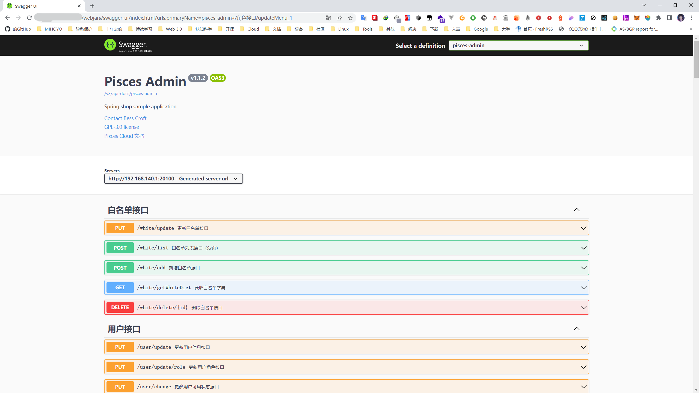

# Swagger 支持

springdoc-openapi 的 java 库有助于使用 Spring Boot 项目自动生成 API 文档。 springdoc-openapi 通过在运行时检查应用程序以根据 SpringBoot 配置、类结构和各种注释来推断 API 语义。

请注意，如果你原来用的是 spring-fox 实现的 swagger 的话，在使用 spring-doc 时，需要注意注释的替换：

- `@Api` → `@Tag`
- `@ApiIgnore` → `@Parameter(hidden = true)` or `@Operation(hidden = true)` or `@Hidden`
- `@ApiImplicitParam` → `@Parameter`
- `@ApiImplicitParams` → `@Parameters`
- `@ApiModel` → `@Schema`
- `@ApiModelProperty(hidden = true)` → `@Schema(accessMode = READ_ONLY)`
- `@ApiModelProperty` → `@Schema`
- `@ApiOperation(value = "foo", notes = "bar")` → `@Operation(summary = "foo", description = "bar")`
- `@ApiParam` → `@Parameter`
- `@ApiResponse(code = 404, message = "foo")` → `@ApiResponse(responseCode = "404", description = "foo")`

- 访问路径配置

```yaml
# SpringDoc 配置
springdoc:
  api-docs:
    # 是否开启
    enable: true
  swagger-ui:
    path: "/swagger-ui.html"
```

启动项目后，从网关的访问地址为：[http://127.0.0.1:8000/swagger-ui.html](http://127.0.0.1:8000/swagger-ui.html)



> 上面这个地址，是在 yaml 中自定义的，它会自动跳转到 [http://127.0.0.1:8000/webjars/swagger-ui/index.html](http://127.0.0.1:8000/webjars/swagger-ui/index.html)

### 新模块如何使用？

#### WebFlux

- Spring WebFlux 支持

网关只需要放 ui 依赖即可。

```xml
<dependency>
    <groupId>org.springdoc</groupId>
    <artifactId>springdoc-openapi-webflux-ui</artifactId>
    <version>${springdoc.version}</version>
</dependency>
```

- yaml 配置

```yaml
spring:
  cloud:
    gateway:
      routes:
        # SpringDoc 分组聚合的路由
        # 路由 ID
        - id: openapi
          uri: http://localhost:${server.port}
          predicates:
            - Path=/v3/api-docs/**
          filters:
            - RewritePath=/v3/api-docs/(?<path>.*), /$\{path}/v3/api-docs

# SpringDoc 配置
springdoc:
  api-docs:
    # 是否开启
    enable: true
  swagger-ui:
    path: "/swagger-ui.html"
    urls:
      - name: pisces-admin
        url: /v3/api-docs/pisces-admin
      - name: pisces-auth
        url: /v3/api-docs/pisces-auth
```

- Spring WebMvc 支持

而每个服务模块，需要添加 core 核心包，并进行配置:

```xml
<dependency>
    <groupId>org.springdoc</groupId>
    <artifactId>springdoc-openapi-webmvc-core</artifactId>
    <version>${springdoc.version}</version>
</dependency>
```

- config 配置如下

```java
package com.besscroft.pisces.admin.config;

import io.swagger.v3.oas.models.ExternalDocumentation;
import io.swagger.v3.oas.models.OpenAPI;
import io.swagger.v3.oas.models.info.Contact;
import io.swagger.v3.oas.models.info.Info;
import io.swagger.v3.oas.models.info.License;
import org.springframework.context.annotation.Bean;
import org.springframework.context.annotation.Configuration;

/**
 * @Description SpringDoc 配置
 * @Author Bess Croft
 */
@Configuration
public class SpringDocConfig {

    @Bean
    public OpenAPI customOpenApi() {
        return new OpenAPI()
                .info(new Info().title("Pisces Admin")
                        .description("Spring shop sample application")
                        .version("v1.1.2")
                        .contact(new Contact()
                                .name("Bess Croft")
                                .email("besscroft@foxmail.com"))
                        .license(new License().name("GPL-3.0 license").url("https://github.com/besscroft/pisces-cloud/blob/main/LICENSE")))
                .externalDocs(new ExternalDocumentation()
                        .description("Pisces Cloud 文档")
                        .url("https://developer.besscroft.com/pisces/"));
    }

}
```

- yaml 配置如下

```yaml
# SpringDoc 配置
springdoc:
  api-docs:
    # 文档生成
    enabled: true
  swagger-ui:
    # 页面展示
    enabled: true
  # 配置扫描的包
  packages-to-scan: com.besscroft.pisces.admin
  cache:
    disabled: false
  pre-loading-enabled: true
```

剩下的环节，就是对每一个接口、请求参数、响应参数添加相应的注解了！
